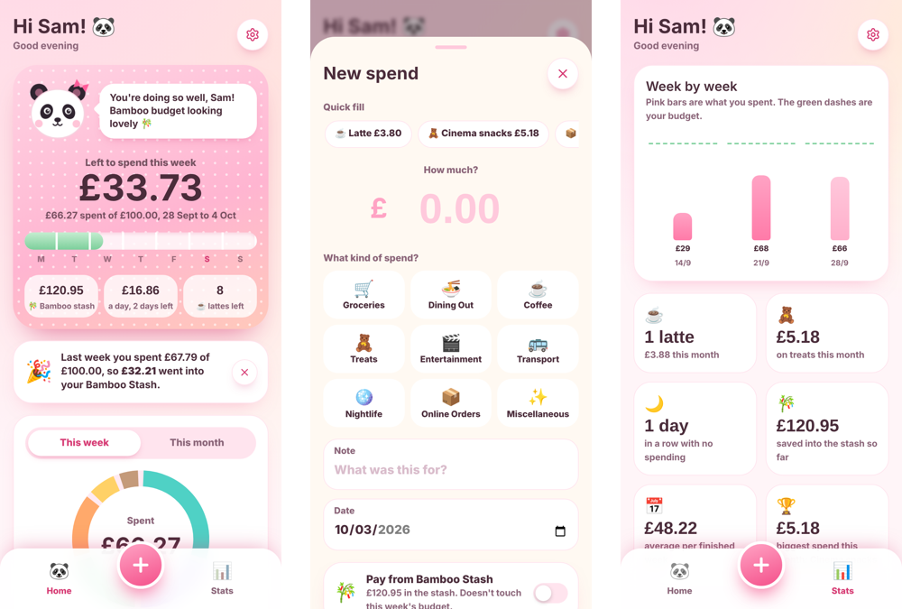

# Panda Budget 🐼

A mobile-first weekly budgeting app for students, built with **React, TypeScript, Vite and Tailwind CSS**. It runs entirely in the browser, needs no account or backend, and can be installed on a phone's home screen.

**Live demo: [panda-budget.netlify.app](https://panda-budget.netlify.app)** (best on a phone, where you can add it to your home screen)

I originally built it as a personalised app for one real user, a student living on a weekly budget, and this repository is the general version.



## Features

- **Weekly budget that resets every Monday.** Shows how much is left this week, a daily allowance for the remaining days, and a progress bar across the week.
- **Bamboo Stash (savings).** Whatever is left of the budget at the end of each full week rolls into a savings stash. Bigger purchases can be paid from the stash without touching this week's budget.
- **Fast logging.** Quick-fill buttons for your usual coffee and recent spends, category tiles, notes and back-dating.
- **Stats.** A week-by-week chart against the budget, a monthly category breakdown, no-spend streaks, and the biggest spend of the month.
- **A mascot that reacts.** The panda's mood and message change depending on how the week is going.
- **Backups.** Export and import all data as JSON from Settings.
- **Installable (PWA).** It has a web app manifest and icons, so it opens full-screen from the home screen.

## Design decisions

- **Derived state, not stored totals.** Weekly totals and the stash balance are recalculated from the list of expenses on every render. They're never saved separately, so editing or deleting an old expense can never leave a balance out of sync.
- **Budget history.** Changing the weekly budget records the date it changed from. Past weeks keep the target they actually had, so old weeks don't suddenly look over or under budget.
- **Fair savings rules.** If you start mid-week, that week is a "warm-up" and doesn't earn into the stash. Spending paid from the stash is excluded from the weekly total.
- **Local-first.** All data lives in `localStorage` under one versioned key (`panda-budget-v1`). Loaded data is validated with a type guard before use, and the app falls back to a fresh state if storage is unavailable or corrupt.
- **Time-aware without a server.** A small `useNow` hook re-renders every minute and when the tab regains focus, so the week rolls over on its own. Adding `?dev` to the URL shows a button that jumps forward a week, for testing the Monday rollover.

## Tech stack

React 18 · TypeScript · Vite · Tailwind CSS · lucide-react icons · Netlify (static hosting)

## Run it locally

```bash
npm install
npm run dev        # also prints a network address you can open on your phone (same Wi-Fi)
npm run typecheck  # TypeScript checks
npm run build      # production build in dist/
```

## Deploy

`netlify.toml` already sets the build command and the publish folder. Connect the repo on Netlify, or run `npm run build` and drag the `dist` folder onto Netlify Drop.

## Ideas for next steps

- Optional cloud sync, so data survives switching phones
- Recurring expenses (rent, subscriptions)
- Unit tests for the date and budget calculations
